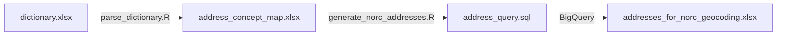

## Module 4: Address Processing & Query Generation for NORC Geocoding

This project contains two scripts designed to help prepare self‐reported addresses from our **Module 4: Where You Live and Work** questionnaire for geocoding by NORC. Our goal is to transform the raw survey data and the accompanying data dictionary into a flattened, long-format mapping file that is easy for NORC to work with—without requiring detailed institutional knowledge of our data structure. Each address record in our survey may include follow-up questions (for participants who do not remember all details), and our scripts capture all relevant fields for geocoding.



## Overview

There are two main scripts:

1.  **Address Mapping Extraction Script (R):**\
    This script parses our data dictionary and extracts the relevant address mappings. It processes different types of addresses (e.g., Home, Seasonal, Childhood, Current Work, Previous Work, and School) by leveraging standardized **Variable Label** values. It then combines all mappings into a single Excel file (`address_concept_map.xlsx`) that is structured in a long format.\
    *Use case:* NORC requires a simplified, unified address file to perform geocoding on our survey data without having to interpret the nuanced structure of our raw survey and dictionary files.

2.  **SQL Query Generation Script (R):**\
    This script reads the combined mapping file (`address_concept_map.xlsx`) and generates a multi-line SQL query for each address mapping. The SQL statements are formatted uniformly (with proper indentation) and then combined using `UNION ALL`. The final query is saved to a file (`generated_query.sql`).\
    *Use case:* The generated SQL query can be used to query our BigQuery data (or another database) to extract the flattened address data that NORC will use for geocoding.

## Prerequisites

-   **R (version ≥ 4.x)** installed on your system.

-   The following R packages must be installed:

    -   `readxl`
    -   `dplyr`
    -   `tidyr`
    -   `stringr`
    -   `writexl`
    -   `janitor`
    -   `glue`

    You can install them using:

    ```         
    install.packages(c("readxl", "dplyr", "tidyr", "stringr", "writexl", "janitor", "glue"))
    ```

-   Your data dictionary Excel file (named `dictionary.xlsx`) must be stored in the working directory. It should contain a sheet named `"MasterSurveyComb_20250210"` that includes the raw dictionary data. The dictionary must include a **variable_label** column with standardized labels (e.g., "Street number", "Full Street name", etc.).

## Script Details

### 1. Address Mapping Extraction Script (R)

-   **Purpose:**\
    Parses the dictionary file to extract and standardize address mappings for multiple address types (Home, Seasonal, Childhood, Current Work, Previous Work, and School). It uses the **variable_label** column and a predefined field map to match fields (e.g., street number, full street name, apartment, city, state, zip code, and country).\

-   **Output:**\
    Produces a combined Excel file `address_concept_map.xlsx` containing a long-format table with columns such as:

    -   `address_src_quest_cid`\
    -   `address_nickname` (custom names like `home_address_1`, `school_address_1`, etc.)\
    -   `st_num_cid`, `st_name_cid`, `apt_num_cid`, `city_cid`, `state_cid`, `zip_cid`, `country_cid`\
    -   Follow-up fields and cross street fields\
    -   `address_type` (e.g., Home, Seasonal, Childhood, Current Work, Previous Work, School)

-   **How to Run:**\
    Open the script in RStudio or run it from the R command line:

    ```         
    source("parse_dictionary.R")
    ```

    This will read `dictionary.xlsx`, process the data, and produce `address_concept_map.xlsx`.

### 2. SQL Query Generation Script (R)

-   **Purpose:**\
    Reads the combined mapping file (`address_concept_map.xlsx`) and generates a multi-line SQL query that formats the flattened address data for geocoding. The query concatenates a SELECT statement for each row (with properly indented projection lists and COALESCE functions for follow-up fields) and combines them using `UNION ALL`.\

-   **Output:**\
    Produces a SQL file `address_query.sql` containing the full query.

-   **How to Run:**\
    Open the script in RStudio or run it from the R command line:

    ```         
    source("generate_norc_addresses.R")
    ```

    This script reads `address_concept_map.xlsx`, generates the query, prints it to the console, and writes it to `address_query.sql`.
